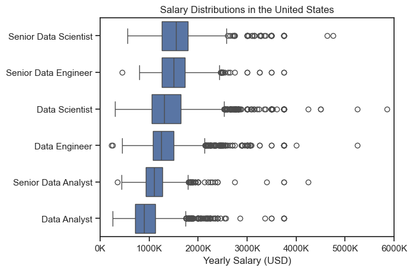
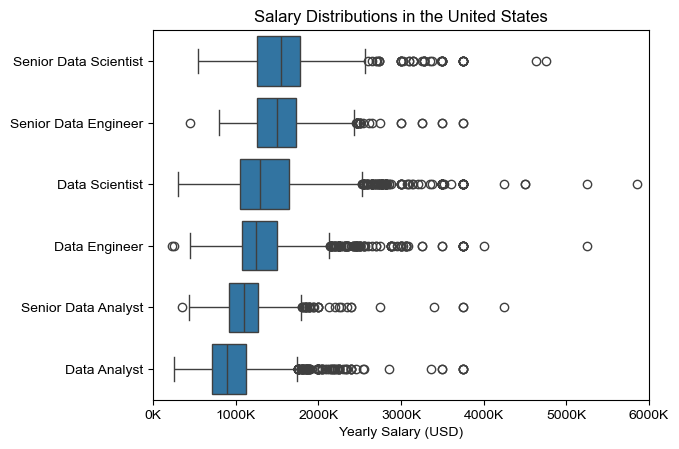
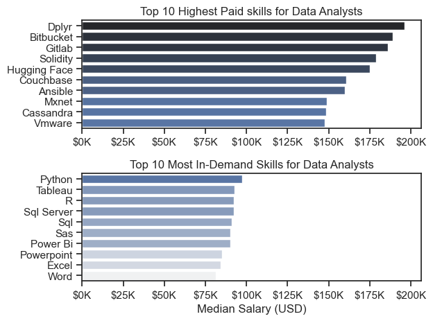

# Overview

Welcome to my analysis of the data job market, focusing on dat analyst roles. This project was created out of a desire to navigate and understand the job market more effectively.

The data sources from [Luke Barousse's Python Course](https://lukebarousse.com/python) which provides a foundation for my analysis, containing detailed information on job titles, salaries, locations, and essential skills. Through a series of Python scripts, I explore key questions such as the most demanded skills, salary trends, and the intersection of demand and salary in data analytics.

# The Questions

Below are the questions I want to answer in my project:

1. What are the skills most in demand for the top 3 most popular data roles?

2. How are in-demand skills trending for Data Analysts?

3. How well do jobs and skills pay for Data Analysts?

4. What are the optimal skills for data analysts to learn? (High Demand AND High Paying)

# Tools I Used

For my deep dive into the data analyst job market, I harnessed the power of several key tools:

- **Python**: the backbone of my analysis, allowing me to analyze the data and find critical insights.

  - **Pandas Library**: This was used to analyze the data.

  - **Matplotlib Library**: I visualized the data.

  - **Seaborn Library**: Helped me create more advanced visuals.

- **Jupyter Notebooks**: The tool I used to run my Python scripts which let me easily include my notes and analysis.

- **Visual Studio Code**: My go-to for executing my Python scripts.

- **Git & GibHub**: Essential for version control and sharing my Python code and analysis, ensuring collaboration and project tracking.

# Data Preparation and Cleanup

This section outlines the steps taken to prepare the data for analysis, ensuring accuracy and usability.

## Import and Clean Up Data

I start by importing necessary libraries and loading the dataset followed by initial data cleaning tasks to ensure data quality.

```python
import ast
import pandas as pd
import seaborn as sns
from datasets import load_dataset
import matplotlib.pyplot as plt

# Loading Data
dataset = load_dataset("lukebarousse/data_jobs")
df = dataset["train"].to_pandas()

# Data Cleanup
df["job_posted_date"] = pd.to_datetime(df.job_posted_date)
df["job_skills"] = df["job_skills"].apply(lambda skills: ast.literal_eval(skills) if pd.notna(skills) else [])
df["job_skills"] = df["job_skills"].apply(lambda skills: [skill.title() for skill in skills] if len(skills) > 0 else skills)
```

## Filter U.S. Jobs

To focus my analysis on the U.S. job market, I apply filters to the datset, narrowing down to roles based in the United States.

```python
df_us = df[df["job_country"] == "United States"]
```

# The Analysis

## 1. What are the most demanded skills for the top 3 most popular data roles?

To find the most demanded skills for the top 3 most popular data roles, I filtered out those positions by which ones were the most popular, and got the top 5 skills for these top 3 roles. This query highlights the most popular job titles and their top skills, showing which skills I should pay attention to depending on the role I'm targeting.

View my notebook with detailed steps here:
[2_Skills_Count.ipynb](project/2_Skills_Count.ipynb)

## Visualize Data

```python
fig, ax = plt.subplots(len(job_titles), 1)

sns.set_theme(style="ticks")

for i, job_title in enumerate(job_titles):
    df_plot = df_skills_count[df_skills_count["job_title_short"] == job_title].head(5)
    sns.barplot(
        data=df_plot,
        x="skill_count",
        y="job_skills",
        ax=ax[i],
        hue="skill_count",
        palette="dark:b_r",
        legend=False
    )
    ax[i].set_title(job_title)
    ax[i].set_ylabel("")
    ax[i].set_xlabel("")
  
fig.suptitle("Counts of Top Skills in Job Postings", fontsize=15)
fig.tight_layout(h_pad=0.5)
plt.show()
```

### Results


### Insights

- Python is a versatile skill, highly demanded across all three roles, but most prominently for Data Scientists (72%) and Data Engineers (65%).

- SQL is the most requested skill for Data Analysts and Data Scientists, with it in over half the job postings for both roles. For Data Engineers, Python is the most sought-after skill, appearing in 68% of job postings.

- Data Engineers require more specialized technical skills (AWS, Azure, Spark) compared to Data Analysts and Data Scientists who are expected to be proficient in more general data managment and analysis tools (Excel, Tableau).

## 2. How are in-demand skills trending for Data Analysts?

### Visualize Data

```python
sns.lineplot(data=df_da_us_percent, dashes=False, palette="tab10")
sns.set_theme(style="ticks")
sns.despine()

plt.title("Trending Top Skills for Data Analysts in the U.S.")
plt.ylabel("Likelihood in Job Posting")
plt.xlabel("2023")
plt.legend().remove()

from matplotlib.ticker import PercentFormatter
ax = plt.gca()
ax.yaxis.set_major_formatter(PercentFormatter(decimals=0))

offsets = {"Tableau": 1, "Python": -1}
x_label = df_da_us_percent.shape[0] - 0.8

for col in df_da_us_percent.columns:
  y = df_da_us_percent.iloc[-1][col]
  dy = offsets.get(col, 0)
  plt.text(x_label, y + dy, col, ha="left", va="center")
```

### Results


*Bar graph visualizing the trending top skills for data analysts in the U.S. in 2023.*

### Insights
- SQL remains the most consistently demanded skill throughout the year, although it shows a gradual decrease in demand.

- Excel experienced a significant increase in demand starting around September, surpassing both Python and Tableau by the end of the year.

- Both Python and Tableau show relatively stable demand throughout the year with some fluctuations but remain essential skills for data analysts. Power BI, while less demanded compared to the others, shows a slight upward trend towards the year's end.

## 3. How well do jobs and skills pay for Data Analysts?

### Salary Anaylsis

#### Visualize Data


```python
sns.boxplot(data=df_us_top6, x="salary_year_avg", y="job_title_short", order=job_titles)
sns.set_theme(style="ticks")

plt.title("Salary Distributions in the United States")
plt.xlabel("Yearly Salary (USD)")
plt.ylabel("")
plt.xlim(0, 600000)
ticks_x = plt.FuncFormatter(lambda x, pos: f"{int(x / 100)}K")
plt.gca().xaxis.set_major_formatter(ticks_x)
plt.show()
```


*Box plot visualizing the salary distributions for the top 6 data job titles.*

## 3. How well do jobs and skills pay for Data Analysts?

To identify the highest-paying roles and skills, I only got jobs in the United States and looked at their median salary. But first I looked at the salary distributions of common data jobs like data Scientist, Data Engineer, and Data Analyst, to get an idea of which jobs are paid the most.

View my notebook with detailed steps here: [4_Salary_Analysis](project/4_Salary_Analysis.ipynb).

#### Visualize Data

```python
sns.boxplot(data=df_us_top6, x="salary_year_avg", y="job_title_short", order=job_titles)
sns.set_theme(style="ticks")

plt.title("Salary Distributions in the United States")
plt.xlabel("Yearly Salary (USD)")
plt.ylabel("")
plt.xlim(0, 600000)
ticks_x = plt.FuncFormatter(lambda x, pos: f"{int(x / 100)}K")
plt.gca().xaxis.set_major_formatter(ticks_x)
plt.show()
```

#### Results


*Box plot visualizing the salry distributions for the top 6 data job titles.*

#### Insights

- There's a significant variation in salary ranges across different job titles. Senior Data Scientist positions tend to have the highest salary potential, with up to $600K, indicating the high value placed on advanced data skills and experience in the industry.

- Senior Data Engineer and Senior Data Scientist roles how a considerable number of outliers on the higher end of the salary spectrum, suggesting that exceptional skills or circumstances can lead to high pay in these roles. In contrast, Data Analyst roles demonstrate more consistency in salary, with fewer outliers.

- The median salaries increase with the seniority and specialization of the roles. Senior roles (Senior Data Scientist, Senior Data Engineer) not only have higher median salaries but also larger differences in typical salaries, reflecting greater variance in compensation as responsibilities increase.

### Highest Paid & Most Demanded Skills for Data Analysts

Next, I narrowed my analysis and focused only on data analyst roles. I looked at the highest-paid skills and the most in-demand skills. I used two bar charts to showcase these.

#### Visualize Data

```python
fig, ax = plt.subplots(2, 1)

sns.set_theme(style="ticks")

sns.barplot(data=df_da_top_pay, x="median", y=df_da_top_pay.index, hue="median", ax=ax[0], palette="dark:b_r")
ax[0].legend().remove()

ax[0].set_title("Top 10 Highest Paid skills for Data Analysts")
ax[0].set_ylabel("")
ax[0].set_xlabel("")
ax[0].xaxis.set_major_formatter(plt.FuncFormatter(lambda x, _: f"${int(x/1000)}K"))

sns.barplot(data=df_da_skills, x="median", y=df_da_skills.index, hue="median", ax=ax[1], palette="light:b")
ax[1].legend().remove()

ax[1].set_title("Top 10 Most In-Demand Skills for Data Analysts")
ax[1].set_ylabel("")
ax[1].set_xlabel("Median Salary (USD)")
ax[1].set_xlim(ax[0].get_xlim())
ax[1].xaxis.set_major_formatter(plt.FuncFormatter(lambda x, _: f"${int(x/1000)}K"))

plt.tight_layout()
plt.show()
```

#### Results

Here's the breakdown of the highest-paid & most in-demand skills for data analysts in the U.S:


*Two separate bar graphs visualizing the highest paid skills and most in-demand skills for data analysts in the U.S.*

#### Insights

- The top graph shows specialized technical skills like `dplyr`, `Bitbucket`, and `Gitlab` are associated with higher slaries, some reaching up to $200K, suggesting that advanced technical proficiency an increase earning potential.

- The bottom graph highlights that foundational skills like `Excel`, `PowerPoint`, and `SQL` are the most in-demand, even though they may not offer the highest salaries. This demonstrates the importance of these core skills for employability in data analysis roles.

- There's a clear distinction between the skills that are the highest paid and those that are most in-demand. Data analysts aiming to maximize their career potential should consider developing a diverse skill set that includes both high-paying specialized skills and widely demanded foundational skills.